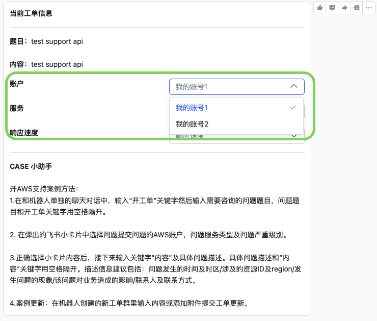
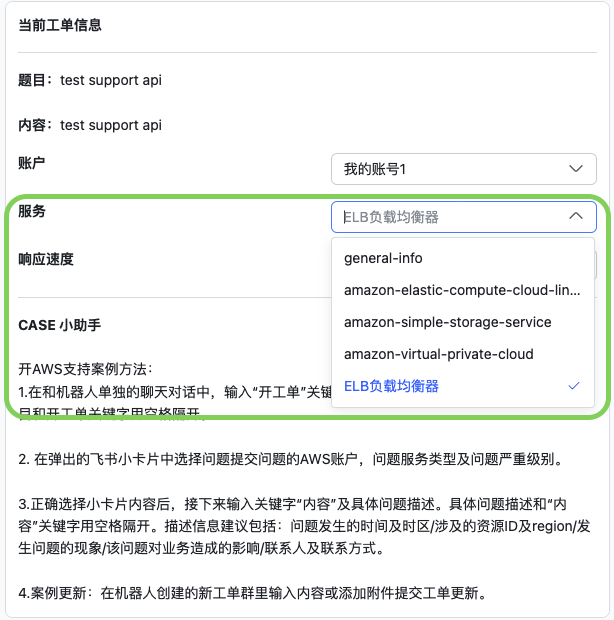
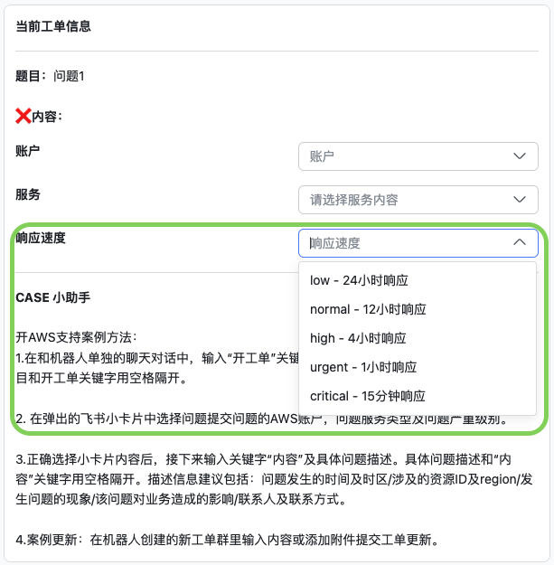
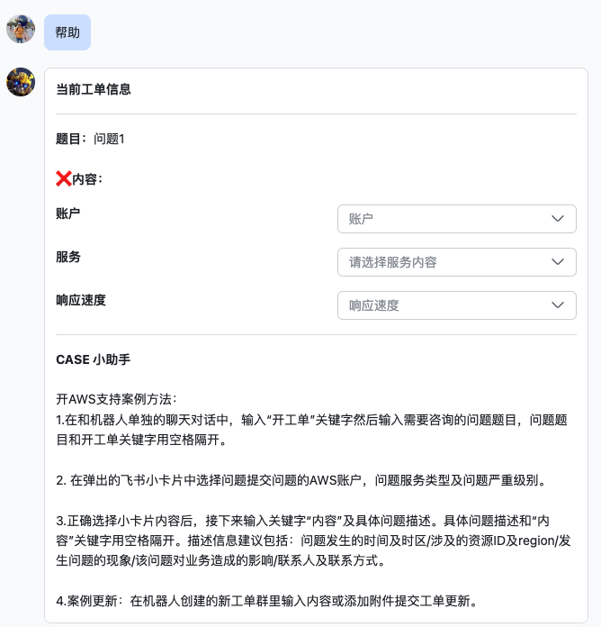
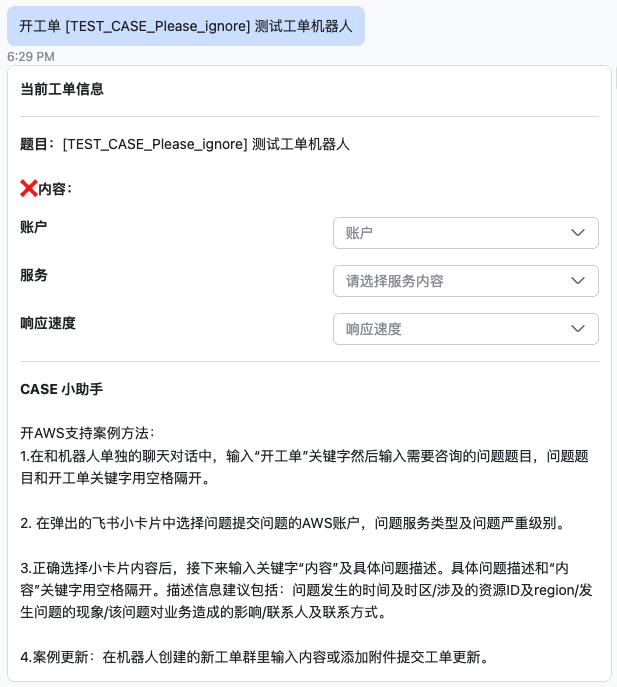
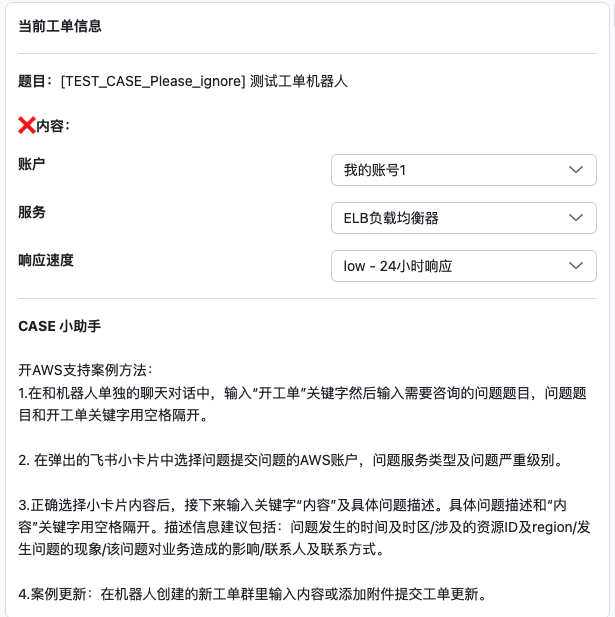
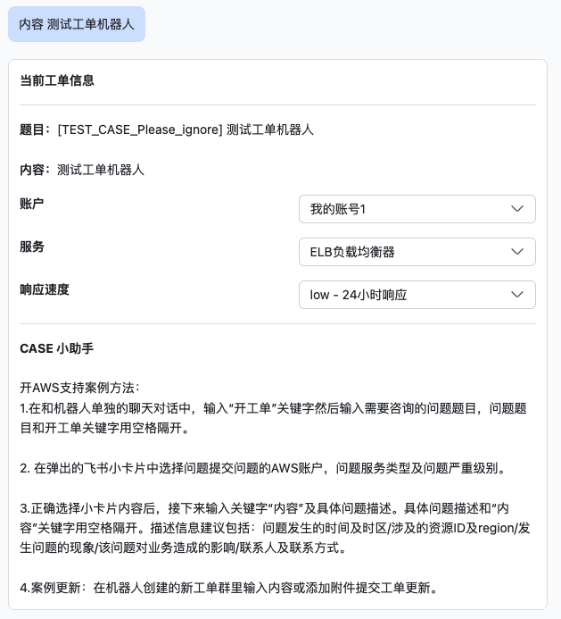

# 基于AWS无服务器架构，实现通过企业飞书即时通信工具与AWS技术支持工程师实时文字互动解决方案

## 说明
---

飞书AWS是一套基于飞书企业通信工具的方便用户和AWS售后工程师快捷文字沟通的工具。飞书用户可以通过简单的机器人互动，向AWS售后工程师团队提交支持案例，更新案例内容，以及准实时接收来自后台工程师的更新。
## 架构图
---


## 安装部署
---
安装部署需要有三个步骤：
1. 通过AWS SAM部署飞书AWS技术支持机器人后端逻辑，包括API Gateway、Eventbridge rule、DynamoDB表和Lambda
2. 在飞书开放平台界面上设定机器人回调地址及必须的权限
3. 设定机器人Profile，指定机器人支持的AWS账号，服务等级及服务列表


### AWS SAM安装
---
AWS Serverless Application Module （SAM）是官方发布的用于在AWS上快速部署无服务应用的开源框架。通过SAM部署方式，可以快捷的部署、更新和回滚飞书AWS技术支持机器人应用环境

部署步骤：
1. 根据[官方文档](https://docs.aws.amazon.com/serverless-application-model/latest/developerguide/serverless-sam-cli-install.html)说明,在本地环境中部署SAM CLI
2. 克隆仓库

`git clone https://github.com/zhang1980s/larkbot.git`

3. 部署飞书AWS技术支持机器人环境


```
cd larkbot
sam build
sam deploy --config-file samconfig.toml --resolve-s3 --stack-name <stack-name> --profile <AWS config profile> --region <AWS region>
```
例如，在AWS宁夏region部署飞书AWS技术支持机器人后端环境：

```
sam deploy --config-file samconfig.toml --region cn-northwest-1 --resolve-s3 --stack-name larkbot --profile cn

                Managed S3 bucket: aws-sam-cli-managed-default-samclisourcebucket-1ld2qm6myh53y
                A different default S3 bucket can be set in samconfig.toml
                Or by specifying --s3-bucket explicitly.
Uploading to dfe967478c4c7077f182f263397f98b4  5990945 / 5990945  (100.00%)

        Deploying with following values
        ===============================
        Stack name                   : larkbot
        Region                       : cn-northwest-1
        Confirm changeset            : False
        Disable rollback             : False
        Deployment s3 bucket         : aws-sam-cli-managed-default-samclisourcebucket-1ld2qm6myh53y
        Capabilities                 : ["CAPABILITY_IAM"]
        Parameter overrides          : {}
        Signing Profiles             : {}

Initiating deployment
=====================
Uploading to d9026176c65ec9864de7bf3c22d4d00b.template  6689 / 6689  (100.00%)

Waiting for changeset to be created..

CloudFormation stack changeset
-------------------------------------------------------------------------------------------------------------------------------------------------------------------------------------------------
Operation                                        LogicalResourceId                                ResourceType                                     Replacement                                    
-------------------------------------------------------------------------------------------------------------------------------------------------------------------------------------------------
+ Add                                            ApiGatewayAccount                                AWS::ApiGateway::Account                         N/A                                            
+ Add                                            ApiGatewayCloudWatchLogsRole                     AWS::IAM::Role                                   N/A                                            
+ Add                                            Deployment                                       AWS::ApiGateway::Deployment                      N/A                                            
+ Add                                            LambdaPermission                                 AWS::Lambda::Permission                          N/A                                            
+ Add                                            LarkBotApiStage                                  AWS::ApiGateway::Stage                           N/A                                            
+ Add                                            LarkBotApi                                       AWS::ApiGateway::RestApi                         N/A                                            
+ Add                                            LarkBotAudittable                                AWS::DynamoDB::Table                             N/A                                            
+ Add                                            LarkBotCasestable                                AWS::DynamoDB::Table                             N/A                                            
+ Add                                            LarkBotCfgtable                                  AWS::DynamoDB::Table                             N/A                                            
+ Add                                            LarkBotLambdaBasicExecutionPolicy                AWS::IAM::Policy                                 N/A                                            
+ Add                                            LarkBotLambdaScheduleEventPermission             AWS::Lambda::Permission                          N/A                                            
+ Add                                            LarkBotLambdaScheduleEvent                       AWS::Events::Rule                                N/A                                            
+ Add                                            LarkBotLambda                                    AWS::Lambda::Function                            N/A                                            
+ Add                                            LarkBotPolicy                                    AWS::IAM::Policy                                 N/A                                            
+ Add                                            LarkBotRequestPOST                               AWS::ApiGateway::Method                          N/A                                            
+ Add                                            LarkBotRole                                      AWS::IAM::Role                                   N/A                                            
-------------------------------------------------------------------------------------------------------------------------------------------------------------------------------------------------

Changeset created successfully. arn:aws-cn:cloudformation:cn-northwest-1:442135446539:changeSet/samcli-deploy1647586702/1cd8fe89-58a8-4f10-a3a1-1fc075345af5


2022-03-18 06:58:30 - Waiting for stack create/update to complete

CloudFormation events from stack operations
-------------------------------------------------------------------------------------------------------------------------------------------------------------------------------------------------
ResourceStatus                                   ResourceType                                     LogicalResourceId                                ResourceStatusReason                           
-------------------------------------------------------------------------------------------------------------------------------------------------------------------------------------------------
CREATE_IN_PROGRESS                               AWS::IAM::Role                                   ApiGatewayCloudWatchLogsRole                     Resource creation Initiated                    
CREATE_IN_PROGRESS                               AWS::ApiGateway::RestApi                         LarkBotApi                                       -                                              
CREATE_IN_PROGRESS                               AWS::DynamoDB::Table                             LarkBotCfgtable                                  -                                              
CREATE_IN_PROGRESS                               AWS::IAM::Role                                   LarkBotRole                                      -                                              
CREATE_IN_PROGRESS                               AWS::DynamoDB::Table                             LarkBotCasestable                                -                                              
CREATE_IN_PROGRESS                               AWS::IAM::Role                                   ApiGatewayCloudWatchLogsRole                     -                                              
CREATE_COMPLETE                                  AWS::ApiGateway::RestApi                         LarkBotApi                                       -                                              
CREATE_IN_PROGRESS                               AWS::ApiGateway::RestApi                         LarkBotApi                                       Resource creation Initiated                    
CREATE_IN_PROGRESS                               AWS::DynamoDB::Table                             LarkBotAudittable                                Resource creation Initiated                    
CREATE_IN_PROGRESS                               AWS::DynamoDB::Table                             LarkBotCasestable                                Resource creation Initiated                    
CREATE_IN_PROGRESS                               AWS::IAM::Role                                   LarkBotRole                                      Resource creation Initiated                    
CREATE_IN_PROGRESS                               AWS::DynamoDB::Table                             LarkBotCfgtable                                  Resource creation Initiated                    
CREATE_IN_PROGRESS                               AWS::DynamoDB::Table                             LarkBotAudittable                                -                                              
CREATE_COMPLETE                                  AWS::IAM::Role                                   ApiGatewayCloudWatchLogsRole                     -                                              
CREATE_COMPLETE                                  AWS::IAM::Role                                   LarkBotRole                                      -                                              
CREATE_IN_PROGRESS                               AWS::ApiGateway::Account                         ApiGatewayAccount                                -                                              
CREATE_IN_PROGRESS                               AWS::IAM::Policy                                 LarkBotPolicy                                    -                                              
CREATE_IN_PROGRESS                               AWS::Lambda::Function                            LarkBotLambda                                    -                                              
CREATE_IN_PROGRESS                               AWS::IAM::Policy                                 LarkBotLambdaBasicExecutionPolicy                -                                              
CREATE_IN_PROGRESS                               AWS::Lambda::Function                            LarkBotLambda                                    Resource creation Initiated                    
CREATE_IN_PROGRESS                               AWS::IAM::Policy                                 LarkBotPolicy                                    Resource creation Initiated                    
CREATE_IN_PROGRESS                               AWS::IAM::Policy                                 LarkBotLambdaBasicExecutionPolicy                Resource creation Initiated                    
CREATE_COMPLETE                                  AWS::ApiGateway::Account                         ApiGatewayAccount                                -                                              
CREATE_IN_PROGRESS                               AWS::ApiGateway::Account                         ApiGatewayAccount                                Resource creation Initiated                    
CREATE_COMPLETE                                  AWS::Lambda::Function                            LarkBotLambda                                    -                                              
CREATE_IN_PROGRESS                               AWS::Lambda::Permission                          LambdaPermission                                 -                                              
CREATE_IN_PROGRESS                               AWS::Events::Rule                                LarkBotLambdaScheduleEvent                       -                                              
CREATE_IN_PROGRESS                               AWS::Lambda::Permission                          LambdaPermission                                 Resource creation Initiated                    
CREATE_IN_PROGRESS                               AWS::Events::Rule                                LarkBotLambdaScheduleEvent                       Resource creation Initiated                    
CREATE_COMPLETE                                  AWS::IAM::Policy                                 LarkBotPolicy                                    -                                              
CREATE_COMPLETE                                  AWS::IAM::Policy                                 LarkBotLambdaBasicExecutionPolicy                -                                              
CREATE_COMPLETE                                  AWS::DynamoDB::Table                             LarkBotAudittable                                -                                              
CREATE_COMPLETE                                  AWS::DynamoDB::Table                             LarkBotCasestable                                -                                              
CREATE_COMPLETE                                  AWS::DynamoDB::Table                             LarkBotCfgtable                                  -                                              
CREATE_COMPLETE                                  AWS::Lambda::Permission                          LambdaPermission                                 -                                              
CREATE_IN_PROGRESS                               AWS::ApiGateway::Method                          LarkBotRequestPOST                               Resource creation Initiated                    
CREATE_IN_PROGRESS                               AWS::ApiGateway::Method                          LarkBotRequestPOST                               -                                              
CREATE_COMPLETE                                  AWS::ApiGateway::Method                          LarkBotRequestPOST                               -                                              
CREATE_IN_PROGRESS                               AWS::ApiGateway::Deployment                      Deployment                                       -                                              
CREATE_IN_PROGRESS                               AWS::ApiGateway::Deployment                      Deployment                                       Resource creation Initiated                    
CREATE_COMPLETE                                  AWS::ApiGateway::Deployment                      Deployment                                       -                                              
CREATE_IN_PROGRESS                               AWS::ApiGateway::Stage                           LarkBotApiStage                                  -                                              
CREATE_COMPLETE                                  AWS::ApiGateway::Stage                           LarkBotApiStage                                  -                                              
CREATE_IN_PROGRESS                               AWS::ApiGateway::Stage                           LarkBotApiStage                                  Resource creation Initiated                    
CREATE_COMPLETE                                  AWS::Events::Rule                                LarkBotLambdaScheduleEvent                       -                                              
CREATE_IN_PROGRESS                               AWS::Lambda::Permission                          LarkBotLambdaScheduleEventPermission             Resource creation Initiated                    
CREATE_IN_PROGRESS                               AWS::Lambda::Permission                          LarkBotLambdaScheduleEventPermission             -                                              
CREATE_COMPLETE                                  AWS::Lambda::Permission                          LarkBotLambdaScheduleEventPermission             -                                              
CREATE_COMPLETE                                  AWS::CloudFormation::Stack                       larkbot                                          -                                              
-------------------------------------------------------------------------------------------------------------------------------------------------------------------------------------------------

CloudFormation outputs from deployed stack
--------------------------------------------------------------------------------------------------------------------------------------------------------------------------------------------------
Outputs                                                                                                                                                                                          
--------------------------------------------------------------------------------------------------------------------------------------------------------------------------------------------------
Key                 LarkBotEndpoint                                                                                                                                                              
Description         Endpoint of the LarkBot                                                                                                                                                      
Value               https://iyxomvhlqi.execute-api.cn-northwest-1.amazonaws.com.cn/Prod                                                                                                          
--------------------------------------------------------------------------------------------------------------------------------------------------------------------------------------------------

Successfully created/updated stack - larkbot in cn-northwest-1

```

4. 删除部署环境

如果不再需要使用飞书AWS技术支持机器人，可以通过下面命令把飞书AWS技术支持机器人相关资源删除。 （如开启了API Gateway / Lambda 的日志，还需要手工访问Cloudwatch log组件执行额外删除动作）

```
aws cloudformation delete-stack --stack-name <name of your lark support bot project > --region <AWS region> --profile <AWS config profile>
```

### 飞书开放平台界面上设定机器人回调地址及必须的权限
---
1. 创建自定义企业应用

飞书开放平台地址：
https://open.feishu.cn/app

登陆飞书开放平台，创建自定义企业应用


2. 设定应用名称/描述及飞书图标


3. 启动企业自建应用的机器人功能


4. 设定消息卡片请求网址

SAM部署完成后会返回LarkBot的API Gateway的Endpoint地址。例如上面部署案例中的Value字段的返回。

```
CREATE_IN_PROGRESS                               AWS::Lambda::Permission                          LarkBotLambdaScheduleEventPermission             Resource creation Initiated                    
CREATE_IN_PROGRESS                               AWS::Lambda::Permission                          LarkBotLambdaScheduleEventPermission             -                                              
CREATE_COMPLETE                                  AWS::Lambda::Permission                          LarkBotLambdaScheduleEventPermission             -                                              
CREATE_COMPLETE                                  AWS::CloudFormation::Stack                       larkbot                                          -                                              
-------------------------------------------------------------------------------------------------------------------------------------------------------------------------------------------------

CloudFormation outputs from deployed stack
--------------------------------------------------------------------------------------------------------------------------------------------------------------------------------------------------
Outputs                                                                                                                                                                                          
--------------------------------------------------------------------------------------------------------------------------------------------------------------------------------------------------
Key                 LarkBotEndpoint                                                                                                                                                              
Description         Endpoint of the LarkBot                                                                                                                                                      
Value               https://iyxomvhlqi.execute-api.cn-northwest-1.amazonaws.com.cn/Prod                                                                                                          
--------------------------------------------------------------------------------------------------------------------------------------------------------------------------------------------------

Successfully created/updated stack - larkbot in cn-northwest-1
```
把 https://iyxomvhlqi.execute-api.cn-northwest-1.amazonaws.com.cn/ 值填入到机器人消息卡片请求网址框中。


5. 在凭证与基础信息部分，获取当前机器人小程序的App ID和App Secret


然后把App ID和App Secret更新到DynamoDB中bot_config表中对应的机器人配置中：
```
"app_id": "cli_xxx",
 "app_secret": "yyy",
```


6. 开通权限

必要的权限：
· 获取与更新群组信息 im:chat
· 读取群消息 im:chat.group_info:readonly
· 获取与发送单聊、群组消息 im:message
· 获取用户在群组中@机器人的消息 im:message.group_at_ms
· 接受群聊中@机器人消息事件 im:message.group_at_msg:readonly
· 获取群组中所有消息 im:message.group_msg
· 获取用户发给机器人的单聊消息 im:message.p2p_msg
· 读取用户发给机器人的单聊信息 im:message.p2p_msg:readonly
· 以应用的身份发消息 im:message:send_as_bot
· 获取与上传图片或文件资源 im:resource


7. 添加事件订阅请求网址及内容
把API Gateway的Endpoint地址再次填入到时间订阅的请求网址URL框中。


然后点击添加事件按钮，在弹出的添加事件窗口中，选择消息与群组类别，然后选择接收消息，点击确认添加。下列事件会被添加到飞书AWS技术支持机器人事件订阅中。

|事件名称|所需权限|
|-------|------|
|接收消息 im,message.receive_v1|获取用户在群组中@机器人的消息|
||获取群组中所有消息|
||读取用户发给机器人的单聊消息|


8. 机器人中飞书开放平台发版时，需选择员工可用范围

### 设定机器人Profile，指定机器人支持的AWS账号，服务等级及服务列表
飞书AWS技术支持机器人支持通过profile的方式指定机器人的配置。一个机器人对应一个profile。每个机器人对应一个API Gateway Endpoint 和一个Lambda函数。通过Lambda的环境变量CFG_KEY指定当前Lambda使用的Profile。通过SAM模版部署完成后，会默认创建一个"CFG_KEY=LarkBotProfile-0"的环境变量。

每个profile对应DynamoDB中bot_config表中的一条项目（Item）。每条项目（Item）分区键（Partition Key）为“key”,分区键的值就是机器人的Profile的名称。每个机器人对应一个Profile，每个Profile的配置，可以在对应的项目中变更。

每个机器人的profile，主要用于自定义三部分内容：

1. AWS账号。开工单时指定当前机器人可以提交支持案例的账号名称。



**配置方式：**

例如当前机器人可以为两个AWS账号提交问题：

在DynamoDB界面中，以JSON视图编辑bot_config表中指定的项目；
在account Attribute下， 参考下面JSON格式增加AWS账号相关的AK/SK。这里的AK/SK需具有访问目标账号support API的权限。

下面示例定义了两个账号的AK/SK：

```
  "accounts": {
    "M": {
      "0": {
        "M": {
          "access_key_id": {
            "S": "<AK0>"
          },
          "secret_access_key": {
            "S": "<SK0>"
          }
        }
      },
      "1": {
        "M": {
          "access_key_id": {
            "S": "AK1"
          },
          "secret_access_key": {
            "S": "SK1"
          }
        }
      }
    }
  }
```

定义了账号的AK/SK后，再在case card template Attribute下找到下面内容，把上面配置中定义的AK/SK对应的账号编码加入到option Attribute中，然后把相关账号的便于识别的名字加入到content Attribute中。例如下面示例中，账号0的名字是”我的账号1“。当通过机器人创建支持案例的时候，账号选项卡中会显示”我的账号1“。


如果有更多的账号，按照相同格式增加更多的账号AK/SK以及菜单显示信息和对应关系。

```
     "extra": {
      "options": [
       {
        "text": {
         "content": "我的账号1",
         "tag": "plain_text"
        },
        "value": "0"
       },
       {
        "text": {
         "content": "我的账号2",
         "tag": "plain_text"
        },
        "value": "1"
       }
      ],
      "placeholder": {
       "content": "账户",
       "tag": "plain_text"
      },
      "tag": "select_static",
      "value": {
       "key": "账户"
      }
     }
```


2. AWS服务。开工单时指定当前机器人支持的AWS服务。



**配置方式：**

在service_map attribute 中，按照下面格式，添加需要的提交问题的服务列表。

每个服务有两部分内容需要填写，第一个内容是service code，第二个内容是service category code。每个service code下通常都会有general-guidance类型的service categories。为了减少小卡片的交互，增加机器人支持的某些服务时，找到general-guidance类型的service category code填写到对应的服务项目中。


```
"service_map": {
  "0": [
   "general-info",
   "using-aws"
  ],
  "1": [
   "amazon-elastic-compute-cloud-linux",
   "other"
  ],
  "2": [
   "amazon-simple-storage-service",
   "general-guidance"
  ],
  "3": [
   "amazon-virtual-private-cloud",
   "general-guidance"
  ],
  "4": [
   "elastic-load-balancing",
   "general-guidance"
  ],
  "5": [
   "aws-identity-and-access-management",
   "general-guidance"
  ],
```

可以通过下面命令获取最新完整的service code和service category code信息.

```
aws support describe-services

```

定义了支持的服务后，再在case card template Attribute下找到下面内容,编辑开工单是小卡片显示的服务内容：


```
     "extra": {
      "options": [
       {
        "text": {
         "content": "general-info",
         "tag": "plain_text"
        },
        "value": "0"
       },
       {
        "text": {
         "content": "amazon-elastic-compute-cloud-linux",
         "tag": "plain_text"
        },
        "value": "1"
       },
       {
        "text": {
         "content": "amazon-simple-storage-service",
         "tag": "plain_text"
        },
        "value": "2"
       },
       {
        "text": {
         "content": "amazon-virtual-private-cloud",
         "tag": "plain_text"
        },
        "value": "3"
       },
       {
        "text": {
         "content": "ELB负载均衡器",
         "tag": "plain_text"
        },
        "value": "4"
       }
      ],
```

3. 工单严重级别。开工单时指定当前机器人支持的严重级别。



**配置方式**

参考下面的配置指定机器人可选的问题严重级别。

设定Sev code映射关系：
```
 "sev_map": {
  "critical": "critical",
  "high": "high",
  "low": "low",
  "normal": "normal",
  "urgent": "urgent"
 },
```

在case card template Attribute设定开工单小卡片显示信息：
```
     "extra": {
      "options": [
       {
        "text": {
         "content": "low - 24小时响应",
         "tag": "plain_text"
        },
        "value": "low"
       },
       {
        "text": {
         "content": "normal - 12小时响应",
         "tag": "plain_text"
        },
        "value": "normal"
       },
       {
        "text": {
         "content": "high - 4小时响应",
         "tag": "plain_text"
        },
        "value": "high"
       },
       {
        "text": {
         "content": "urgent - 1小时响应",
         "tag": "plain_text"
        },
        "value": "urgent"
       },
       {
        "text": {
         "content": "critical - 15分钟响应",
         "tag": "plain_text"
        },
        "value": "critical"
       }
      ],
```

4. 指定提示内容。开工单时指定当前机器人小卡片的提示内容。


**配置方式：**

在case card template Attribute中，找到下面内容，设定开工单小卡片中提示的内容。

```
     "content": "\n --------------\n**CASE 小助手**\n\n开AWS支持案例方法：\n1.在和机器人单独的聊天对话中，输入“开工单”关键字然后输入需要咨询的问题题目，问题题目和开工单关键字用空格隔开。\t\n\n2. 在弹出的飞书小卡片中选择问题提交问题的AWS账户，问题服务类型及问题严重级别。\t\n\n3.正确选择小卡片内容后，接下来输入关键字“内容”及具体问题描述。具体问题描述和“内容”关键字用空格隔开。描述信息建议包括：问题发生的时间及时区/涉及的资源ID及region/发生问题的现象/该问题对业务造成的影响/联系人及联系方式。\t\n\n4.案例更新：在机器人创建的新工单群里输入内容或添加附件提交工单更新。",
     "tag": "markdown"
    }
```

### 完整参考bot_config项目设定：

https://github.com/zhang1980s/larkbot/blob/main/ddb-config-example/bot_config.json

## 使用方式
---
### 开支持案例
0. 在和机器人的1:1聊天中，输入帮助关键字获取开支持案例相关帮助(可选步骤)。



1. 输入开工单关键字及需要提交的案例题目创建案例，案例题目和开工单关键字中间用空格分割开。



2. 在接下来弹出的小卡片中选择工单要提交到哪个AWS账号，工单问题的服务类型及工单的严重级别。



3. 然后输入内容关键字及案例内容，案例内容和内容关键字中间用空格分隔开。


4. 完成提交案例所需的全部信息后，机器人会自动创建一个以支持案例 ID + 案例题目命名的飞书群聊。
5. 如果在部署环境过程中需要创建测试案例时，在案例的问题中以[TEST_CASE_Please_ignore](https://docs.aws.amazon.com/awssupport/latest/user/Welcome.html#endpoint)开头，后台工程师会忽略这个支持案例。
### 更新支持案例
1. 在机器人创建的以支持案例ID+案例题目命名的飞书群聊中任何用户输入的任何文字信息即可更新到支持案例中。附件信息例如截屏，日志文件等也会以附件的方式附加到支持案例中。当AWS support API收到文本消息后，机器人会确认消息已经收到。如果飞书服务器和API Gateway之间的网络状况不佳，可能会有丢失消息的情况，例如把飞书AWS技术支持机器人部署在AWS海外region，这时候则需要重新发送消息。


### 后台更新自动推送
1. 飞书AWS技术支持机器人后端逻辑会根据eventbridge的rule的执行时间间隔更新支持案例内容，AWS支持工程师在后端的更新及支持案例在AWS界面的更新都会被自动推送到相关支持案例的群里面。
本文sam模版中默认使用了2分钟的间隔，可以通过修改这个参数调整时间间隔。
```
      Events:
        ScheduleEvent:
          Type: Schedule
          Properties:
            Schedule: "rate(10 minutes)"
            Description: "Execute Lark bot every 10 minutes"
            Input: '{"schema":"2.0","event":{"message":{"message_type":"fresh_comment"}}}'
            Enabled: true
```

### 多机器人配置
实际环境中可能会遇到指定团队只可以通过机器人提交限定账号及限定服务相关的问题的场景，例如团队A只能对账号ABC的一系列服务进行提问，团队B只能对账号DEF的一系列服务进行提问，这种情况可以通过创建多个机器人并为不同机器人指定不同的配置文件的方式来实现。

机器人的自定义配置通过每个机器人的lambda函数的环境变量来指定，例如：

`    --environment Variables={CFG_KEY=lark-support-bot-1} `

指定CFG_KEY后，在config_bot表中单独创建一条以指定CFG_KEY名字为key的记录，例如：
``` 
"key": "lark-support-bot-1",
"app_id": "cli_xxx",
"app_secret": "yyy",
 ```

为每个机器人创建独立的lambda函数并且制定CFG_KEY环境变量，就可以实现多机器人个性化配置的功能

### 提交中国区案例支持
机器人默认会把支持案例提交到AWS海外支持团队。如果需要向AWS宁夏及北京地区的支持团队提交技术支持案例，则需要增加下面的lambda环境变量:
`    --environment Variables={SUPPORT_REGION=cn} `

飞书AWS技术支持机器人会把使用中国区的Endpoint验证support API的credential。

**注意** 由于AWS中国区不支持多语言选择，如果指定了SUPPORT_REGION=cn,需要删除CASE_LANGUAGE环境变量。

### 工单系统多语言支持
AWS 工单（CASE）系统新增语言支持，可选的语言有英文(en)，中文(zh)，日文(ja)，韩文(ko)。机器人可以通过环境变量控制工单（CASE）语言选择。模版默认会选择把工单（CASE）发送到中文队列，如果需要修改默认值，可以在sam部署时使用下面参数选择其他的语言队列：

` --environment Variables={CASE_LANGUAGE=jp}`

上面参数会指定这个机器人会把工单（CASE）开到日语队列中。

如果没有指定这个环境变量，机器人会默认把工单开到英文队列中。

**注意** 由于AWS中国区不支持多语言选择，如果指定了SUPPORT_REGION=cn,需要删除CASE_LANGUAGE环境变量。

### 使用成本
根据case数量，刷新频率决定。正常来说free tier完全可以覆盖，成本为0。 需要关注Cloudwatch log的历史日志信息及DynamoDB中的历史CASE信息。
## TODO List
[TODO List](TODO.md)
