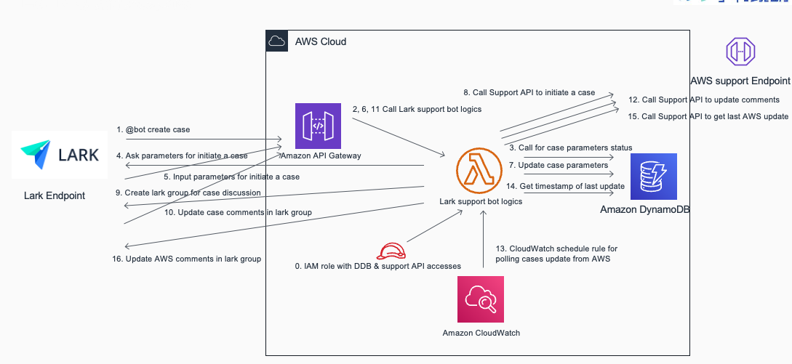
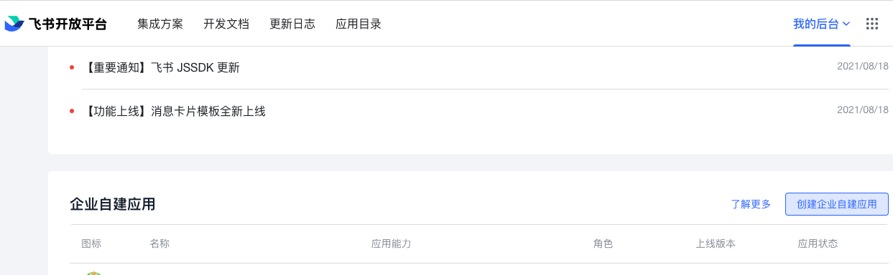
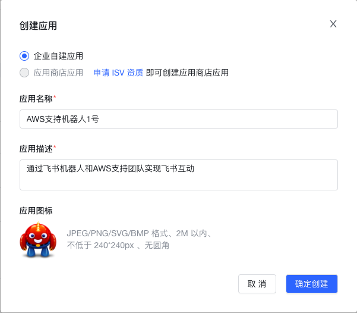
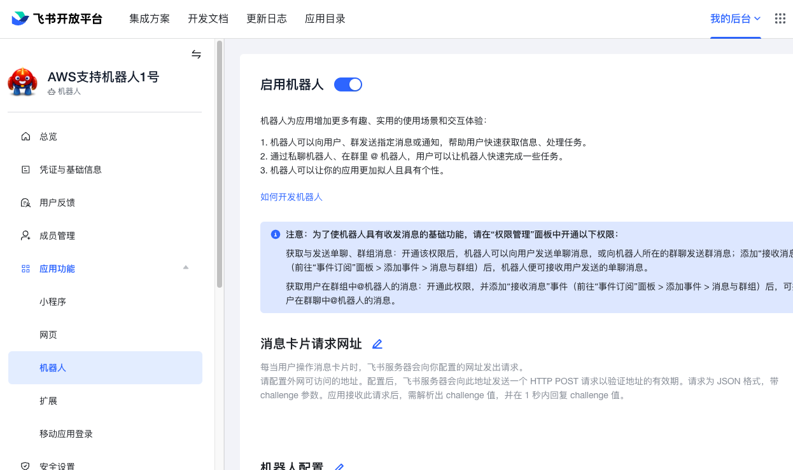
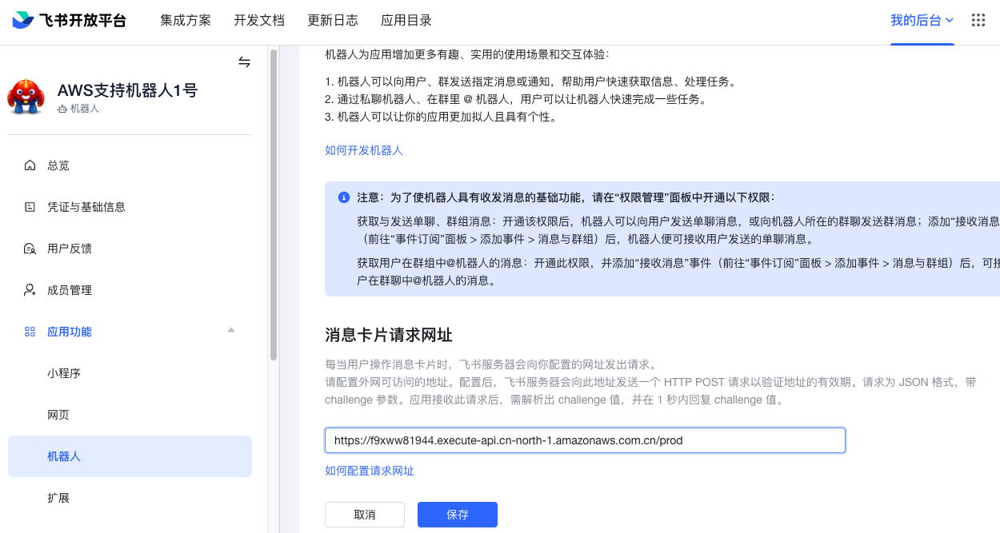
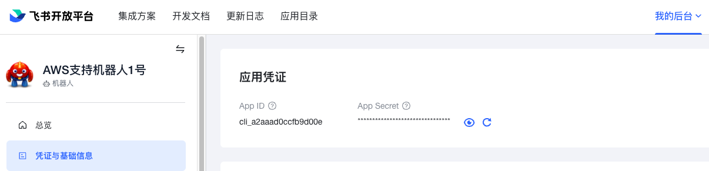
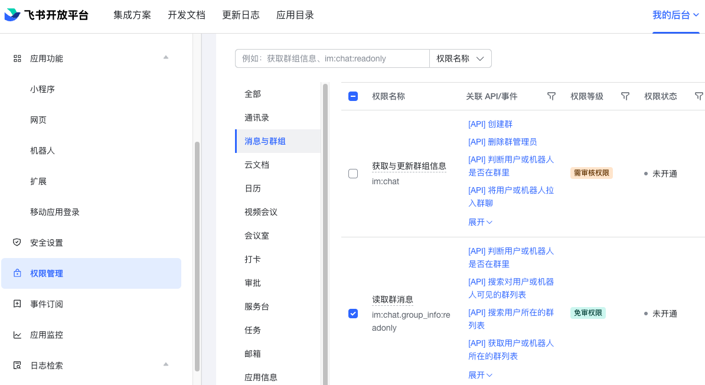
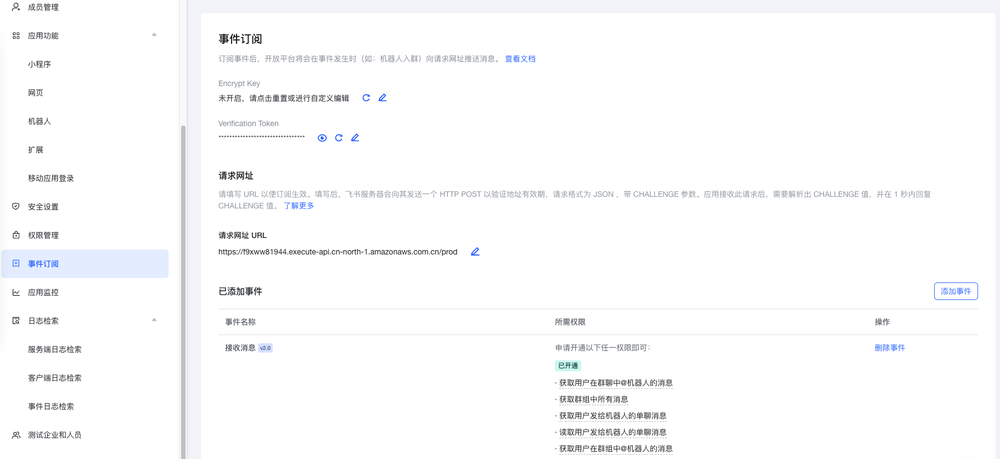
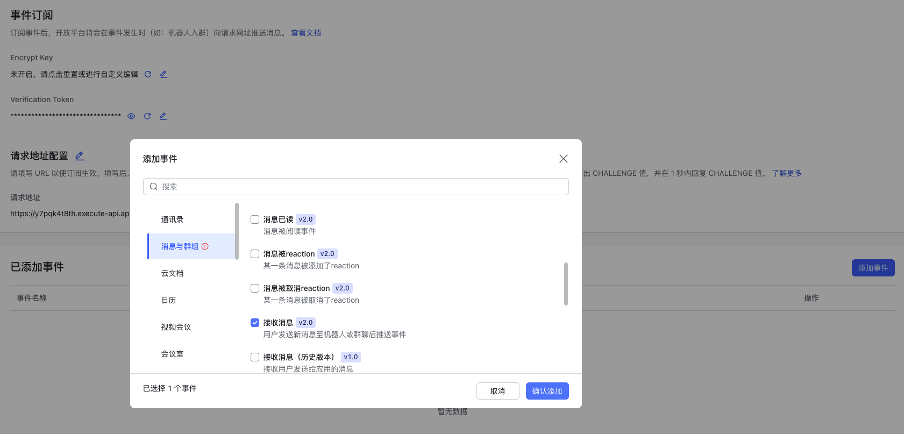

# 基于AWS无服务器架构，实现通过企业飞书即时通信工具与AWS技术支持工程师实时文字互动解决方案

[TOC]
## 说明
---

飞书机器人是一套基于飞书企业通信工具的方便用户和AWS售后工程师快捷文字沟通的工具。飞书用户可以通过简单的机器人互动，向AWS售后工程师团队提交支持案例，更新案例内容，以及准实时接收来自后台工程师的更新。
## 架构图
---


## AWS SAM 安装
---
AWS Serverless Application Module （SAM）是官方发布的用于在AWS上快速部署无服务应用的开源框架。通过SAM部署方式，可以快捷的部署、更新和回滚飞书机器人应用环境

部署步骤：
1. 根据[官方文档](https://docs.aws.amazon.com/serverless-application-model/latest/developerguide/serverless-sam-cli-install.html)说明,在本地环境中部署SAM CLI
2. 克隆仓库

`git clone https://github.com/zhang1980s/larkbot.git`

3. 部署飞书机器人环境


```
cd larkbot
sam build
sam deploy --config-file samconfig.toml --resolve-s3 --stack-name <stack-name> --profile <AWS config profile> --region <AWS region>
```
例如，在AWS宁夏region部署飞书机器人后端环境：

```
sam deploy --config-file samconfig.toml --region cn-northwest-1 --resolve-s3 --stack-name larkbot --profile cn

                Managed S3 bucket: aws-sam-cli-managed-default-samclisourcebucket-1ld2qm6myh53y
                A different default S3 bucket can be set in samconfig.toml
                Or by specifying --s3-bucket explicitly.
Uploading to dfe967478c4c7077f182f263397f98b4  5990945 / 5990945  (100.00%)

        Deploying with following values
        ===============================
        Stack name                   : larkbot
        Region                       : cn-northwest-1
        Confirm changeset            : False
        Disable rollback             : False
        Deployment s3 bucket         : aws-sam-cli-managed-default-samclisourcebucket-1ld2qm6myh53y
        Capabilities                 : ["CAPABILITY_IAM"]
        Parameter overrides          : {}
        Signing Profiles             : {}

Initiating deployment
=====================
Uploading to d9026176c65ec9864de7bf3c22d4d00b.template  6689 / 6689  (100.00%)

Waiting for changeset to be created..

CloudFormation stack changeset
-------------------------------------------------------------------------------------------------------------------------------------------------------------------------------------------------
Operation                                        LogicalResourceId                                ResourceType                                     Replacement                                    
-------------------------------------------------------------------------------------------------------------------------------------------------------------------------------------------------
+ Add                                            ApiGatewayAccount                                AWS::ApiGateway::Account                         N/A                                            
+ Add                                            ApiGatewayCloudWatchLogsRole                     AWS::IAM::Role                                   N/A                                            
+ Add                                            Deployment                                       AWS::ApiGateway::Deployment                      N/A                                            
+ Add                                            LambdaPermission                                 AWS::Lambda::Permission                          N/A                                            
+ Add                                            LarkBotApiStage                                  AWS::ApiGateway::Stage                           N/A                                            
+ Add                                            LarkBotApi                                       AWS::ApiGateway::RestApi                         N/A                                            
+ Add                                            LarkBotAudittable                                AWS::DynamoDB::Table                             N/A                                            
+ Add                                            LarkBotCasestable                                AWS::DynamoDB::Table                             N/A                                            
+ Add                                            LarkBotCfgtable                                  AWS::DynamoDB::Table                             N/A                                            
+ Add                                            LarkBotLambdaBasicExecutionPolicy                AWS::IAM::Policy                                 N/A                                            
+ Add                                            LarkBotLambdaScheduleEventPermission             AWS::Lambda::Permission                          N/A                                            
+ Add                                            LarkBotLambdaScheduleEvent                       AWS::Events::Rule                                N/A                                            
+ Add                                            LarkBotLambda                                    AWS::Lambda::Function                            N/A                                            
+ Add                                            LarkBotPolicy                                    AWS::IAM::Policy                                 N/A                                            
+ Add                                            LarkBotRequestPOST                               AWS::ApiGateway::Method                          N/A                                            
+ Add                                            LarkBotRole                                      AWS::IAM::Role                                   N/A                                            
-------------------------------------------------------------------------------------------------------------------------------------------------------------------------------------------------

Changeset created successfully. arn:aws-cn:cloudformation:cn-northwest-1:442135446539:changeSet/samcli-deploy1647586702/1cd8fe89-58a8-4f10-a3a1-1fc075345af5


2022-03-18 06:58:30 - Waiting for stack create/update to complete

CloudFormation events from stack operations
-------------------------------------------------------------------------------------------------------------------------------------------------------------------------------------------------
ResourceStatus                                   ResourceType                                     LogicalResourceId                                ResourceStatusReason                           
-------------------------------------------------------------------------------------------------------------------------------------------------------------------------------------------------
CREATE_IN_PROGRESS                               AWS::IAM::Role                                   ApiGatewayCloudWatchLogsRole                     Resource creation Initiated                    
CREATE_IN_PROGRESS                               AWS::ApiGateway::RestApi                         LarkBotApi                                       -                                              
CREATE_IN_PROGRESS                               AWS::DynamoDB::Table                             LarkBotCfgtable                                  -                                              
CREATE_IN_PROGRESS                               AWS::IAM::Role                                   LarkBotRole                                      -                                              
CREATE_IN_PROGRESS                               AWS::DynamoDB::Table                             LarkBotCasestable                                -                                              
CREATE_IN_PROGRESS                               AWS::IAM::Role                                   ApiGatewayCloudWatchLogsRole                     -                                              
CREATE_COMPLETE                                  AWS::ApiGateway::RestApi                         LarkBotApi                                       -                                              
CREATE_IN_PROGRESS                               AWS::ApiGateway::RestApi                         LarkBotApi                                       Resource creation Initiated                    
CREATE_IN_PROGRESS                               AWS::DynamoDB::Table                             LarkBotAudittable                                Resource creation Initiated                    
CREATE_IN_PROGRESS                               AWS::DynamoDB::Table                             LarkBotCasestable                                Resource creation Initiated                    
CREATE_IN_PROGRESS                               AWS::IAM::Role                                   LarkBotRole                                      Resource creation Initiated                    
CREATE_IN_PROGRESS                               AWS::DynamoDB::Table                             LarkBotCfgtable                                  Resource creation Initiated                    
CREATE_IN_PROGRESS                               AWS::DynamoDB::Table                             LarkBotAudittable                                -                                              
CREATE_COMPLETE                                  AWS::IAM::Role                                   ApiGatewayCloudWatchLogsRole                     -                                              
CREATE_COMPLETE                                  AWS::IAM::Role                                   LarkBotRole                                      -                                              
CREATE_IN_PROGRESS                               AWS::ApiGateway::Account                         ApiGatewayAccount                                -                                              
CREATE_IN_PROGRESS                               AWS::IAM::Policy                                 LarkBotPolicy                                    -                                              
CREATE_IN_PROGRESS                               AWS::Lambda::Function                            LarkBotLambda                                    -                                              
CREATE_IN_PROGRESS                               AWS::IAM::Policy                                 LarkBotLambdaBasicExecutionPolicy                -                                              
CREATE_IN_PROGRESS                               AWS::Lambda::Function                            LarkBotLambda                                    Resource creation Initiated                    
CREATE_IN_PROGRESS                               AWS::IAM::Policy                                 LarkBotPolicy                                    Resource creation Initiated                    
CREATE_IN_PROGRESS                               AWS::IAM::Policy                                 LarkBotLambdaBasicExecutionPolicy                Resource creation Initiated                    
CREATE_COMPLETE                                  AWS::ApiGateway::Account                         ApiGatewayAccount                                -                                              
CREATE_IN_PROGRESS                               AWS::ApiGateway::Account                         ApiGatewayAccount                                Resource creation Initiated                    
CREATE_COMPLETE                                  AWS::Lambda::Function                            LarkBotLambda                                    -                                              
CREATE_IN_PROGRESS                               AWS::Lambda::Permission                          LambdaPermission                                 -                                              
CREATE_IN_PROGRESS                               AWS::Events::Rule                                LarkBotLambdaScheduleEvent                       -                                              
CREATE_IN_PROGRESS                               AWS::Lambda::Permission                          LambdaPermission                                 Resource creation Initiated                    
CREATE_IN_PROGRESS                               AWS::Events::Rule                                LarkBotLambdaScheduleEvent                       Resource creation Initiated                    
CREATE_COMPLETE                                  AWS::IAM::Policy                                 LarkBotPolicy                                    -                                              
CREATE_COMPLETE                                  AWS::IAM::Policy                                 LarkBotLambdaBasicExecutionPolicy                -                                              
CREATE_COMPLETE                                  AWS::DynamoDB::Table                             LarkBotAudittable                                -                                              
CREATE_COMPLETE                                  AWS::DynamoDB::Table                             LarkBotCasestable                                -                                              
CREATE_COMPLETE                                  AWS::DynamoDB::Table                             LarkBotCfgtable                                  -                                              
CREATE_COMPLETE                                  AWS::Lambda::Permission                          LambdaPermission                                 -                                              
CREATE_IN_PROGRESS                               AWS::ApiGateway::Method                          LarkBotRequestPOST                               Resource creation Initiated                    
CREATE_IN_PROGRESS                               AWS::ApiGateway::Method                          LarkBotRequestPOST                               -                                              
CREATE_COMPLETE                                  AWS::ApiGateway::Method                          LarkBotRequestPOST                               -                                              
CREATE_IN_PROGRESS                               AWS::ApiGateway::Deployment                      Deployment                                       -                                              
CREATE_IN_PROGRESS                               AWS::ApiGateway::Deployment                      Deployment                                       Resource creation Initiated                    
CREATE_COMPLETE                                  AWS::ApiGateway::Deployment                      Deployment                                       -                                              
CREATE_IN_PROGRESS                               AWS::ApiGateway::Stage                           LarkBotApiStage                                  -                                              
CREATE_COMPLETE                                  AWS::ApiGateway::Stage                           LarkBotApiStage                                  -                                              
CREATE_IN_PROGRESS                               AWS::ApiGateway::Stage                           LarkBotApiStage                                  Resource creation Initiated                    
CREATE_COMPLETE                                  AWS::Events::Rule                                LarkBotLambdaScheduleEvent                       -                                              
CREATE_IN_PROGRESS                               AWS::Lambda::Permission                          LarkBotLambdaScheduleEventPermission             Resource creation Initiated                    
CREATE_IN_PROGRESS                               AWS::Lambda::Permission                          LarkBotLambdaScheduleEventPermission             -                                              
CREATE_COMPLETE                                  AWS::Lambda::Permission                          LarkBotLambdaScheduleEventPermission             -                                              
CREATE_COMPLETE                                  AWS::CloudFormation::Stack                       larkbot                                          -                                              
-------------------------------------------------------------------------------------------------------------------------------------------------------------------------------------------------

CloudFormation outputs from deployed stack
--------------------------------------------------------------------------------------------------------------------------------------------------------------------------------------------------
Outputs                                                                                                                                                                                          
--------------------------------------------------------------------------------------------------------------------------------------------------------------------------------------------------
Key                 LarkBotEndpoint                                                                                                                                                              
Description         Endpoint of the LarkBot                                                                                                                                                      
Value               https://iyxomvhlqi.execute-api.cn-northwest-1.amazonaws.com.cn/Prod                                                                                                          
--------------------------------------------------------------------------------------------------------------------------------------------------------------------------------------------------

Successfully created/updated stack - larkbot in cn-northwest-1

```

4. 删除部署环境

如果不再需要使用飞书机器人，可以通过下面命令把飞书机器人相关资源删除。 （如开启了API Gateway / Lambda 的日志，还需要手工访问Cloudwatch log组件执行额外删除动作）

```
aws cloudformation delete-stack --stack-name <name of your lark support bot project > --region <AWS region> --profile <AWS config profile>
```

### 飞书企业管理界面上设定机器人
---
1. 创建自定义企业应用

飞书开放平台地址：
https://open.feishu.cn/app

登陆飞书开放平台，创建自定义企业应用



2. 设定应用名称/描述及飞书图标



3. 启动企业自建应用的机器人功能



4. 设定消息卡片请求网址

SAM部署完成后会返回LarkBot的API Gateway的Endpoint地址。例如上面部署案例中的Value字段的返回。

```
CREATE_IN_PROGRESS                               AWS::Lambda::Permission                          LarkBotLambdaScheduleEventPermission             Resource creation Initiated                    
CREATE_IN_PROGRESS                               AWS::Lambda::Permission                          LarkBotLambdaScheduleEventPermission             -                                              
CREATE_COMPLETE                                  AWS::Lambda::Permission                          LarkBotLambdaScheduleEventPermission             -                                              
CREATE_COMPLETE                                  AWS::CloudFormation::Stack                       larkbot                                          -                                              
-------------------------------------------------------------------------------------------------------------------------------------------------------------------------------------------------

CloudFormation outputs from deployed stack
--------------------------------------------------------------------------------------------------------------------------------------------------------------------------------------------------
Outputs                                                                                                                                                                                          
--------------------------------------------------------------------------------------------------------------------------------------------------------------------------------------------------
Key                 LarkBotEndpoint                                                                                                                                                              
Description         Endpoint of the LarkBot                                                                                                                                                      
Value               https://iyxomvhlqi.execute-api.cn-northwest-1.amazonaws.com.cn/Prod                                                                                                          
--------------------------------------------------------------------------------------------------------------------------------------------------------------------------------------------------

Successfully created/updated stack - larkbot in cn-northwest-1
```
把https://iyxomvhlqi.execute-api.cn-northwest-1.amazonaws.com.cn/值填入到机器人消息卡片请求网址框中。




5. 在凭证与基础信息部分，获取当前机器人小程序的App ID和App Secret


然后把App ID和App Secret更新到DynamoDB中bot_config表中对应的机器人配置中：
```
"app_id": "cli_xxx",
 "app_secret": "yyy",
```


6. 开通权限

必要的权限：
· 获取与更新群组信息 im:chat
· 读取群消息 im:chat.group_info:readonly
· 获取与发送单聊、群组消息 im:message
· 获取用户在群组中@机器人的消息 im:message.group_at_ms
· 接受群聊中@机器人消息事件 im:message.group_at_msg:readonly
· 获取群组中所有消息 im:message.group_msg
· 获取用户发给机器人的单聊消息 im:message.p2p_msg
· 读取用户发给机器人的单聊信息 im:message.p2p_msg:readonly
· 以应用的身份发消息 im:message:send_as_bot
· 获取与上传图片或文件资源 im:resource


7. 添加事件订阅请求网址及内容
把API Gateway的Endpoint地址再次填入到时间订阅的请求网址URL框中。


然后点击添加事件按钮，在弹出的添加事件窗口中，选择消息与群组类别，然后选择接收消息，点击确认添加。下列事件会被添加到飞书机器人事件订阅中。

|事件名称|所需权限|
|-------|------|
|接收消息 im,message.receive_v1|获取用户在群组中@机器人的消息|
||获取群组中所有消息|
||读取用户发给机器人的单聊消息|




8. 机器人中飞书开放平台发版时，需选择员工可用范围，
## 使用方式
---
### 开支持案例
1. 在和机器人的1:1聊天中，输入帮助关键字获取开支持案例相关帮助。
2. 输入开工单关键字及需要提交的案例题目创建案例，案例题目和开工单关键字中间用空格分割开。
3. 在接下来弹出的小卡片中选择工单要提交到哪个AWS账号，工单问题的服务类型及工单的严重级别。
4. 然后输入内容关键字及案例内容，案例内容和内容关键字中间用空格分隔开。
5. 完成提交案例所需的全部信息后，机器人会自动创建一个以支持案例 ID + 案例题目命名的飞书群聊。
4. 如果在部署环境过程中需要创建测试案例时，在案例的问题中以[TEST_CASE_Please_ignore](https://docs.aws.amazon.com/awssupport/latest/user/Welcome.html#endpoint)开头，后台工程师会忽略这个支持案例。
### 更新支持案例
1. 在机器人创建的以支持案例ID+案例题目命名的飞书群聊中任何用户输入的任何文字信息即可更新到支持案例中。附件信息例如截屏，日志文件等也会以附件的方式附加到支持案例中。当AWS support API收到文本消息后，机器人会确认消息已经收到。如果飞书服务器和API Gateway之间的网络状况不佳，可能会有丢失消息的情况，例如把飞书机器人部署在AWS海外region，这时候则需要重新发送消息。

### 后台更新自动推送
1. 飞书机器人后端逻辑会根据eventbridge的rule的执行时间间隔更新支持案例内容，AWS支持工程师在后端的更新及支持案例在AWS界面的更新都会被自动推送到相关支持案例的群里面。
本文sam模版中默认使用了10分钟的间隔，可以通过修改这个参数调整时间间隔。
```
      Events:
        ScheduleEvent:
          Type: Schedule
          Properties:
            Schedule: "rate(10 minutes)"
            Description: "Execute Lark bot every 10 minutes"
            Input: '{"schema":"2.0","event":{"message":{"message_type":"fresh_comment"}}}'
            Enabled: true
```

### 多机器人配置
实际环境中可能会遇到指定团队只可以通过机器人提交限定账号及限定服务相关的问题的场景，例如团队A只能对账号ABC的一系列服务进行提问，团队B只能对账号DEF的一系列服务进行提问，这种情况可以通过创建多个机器人并为不同机器人指定不同的配置文件的方式来实现。

机器人的自定义配置通过每个机器人的lambda函数的环境变量来指定，例如：

`    --environment Variables={CFG_KEY=lark-support-bot-1} `

指定CFG_KEY后，在config_bot表中单独创建一条以指定CFG_KEY名字为key的记录，例如：
``` 
"key": "lark-support-bot-1",
"app_id": "cli_xxx",
"app_secret": "yyy",
 ```

为每个机器人创建独立的lambda函数并且制定CFG_KEY环境变量，就可以实现多机器人个性化配置的功能

### 提交中国区案例支持
机器人默认会把支持案例提交到AWS海外支持团队。如果需要向AWS宁夏及北京地区的支持团队提交技术支持案例，则需要增加下面的lambda环境变量:
`    --environment Variables={SUPPORT_REGION=cn} `

飞书机器人会把使用中国区的Endpoint验证support API的credential。

### 多语言支持
AWS CASE系统新增语言支持，可选的语言有英文，中文，日文，韩文。机器人可以通过环境变量控制CASE语言选择。模版默认会选择把CASE发送到中文队列，如果需要修改默认值，可以在sam部署时使用下面参数选择其他的语言队列：

` --environment Variables={CASE_LANGUAGE=jp}`

上面参数会指定这个机器人会把case开到日语队列中。

### 使用成本
TBD
## TODO List
[TODO List](TODO.md)


## 手工安装方式
---
飞书机器人手工安装分3部分：
1. 创建带访问AWS支持权限的飞书机器人IAM账号
2. 设定飞书机器人后端
3. 飞书企业管理界面上设定机器人

### 创建带访问AWS支持权限的飞书机器人IAM账号
1. 在需要开支持案例的账号下创建飞书机器人IAM账号，并且生成AKSK

> Grant full 支持案例 api access

```
{
    "Version": "2012-10-17",
    "Statement": [
        {
            "Effect": "Allow",
            "Action": [
                "support:*"
            ],
            "Resource": "*"
        }
    ]
}
```

1. 关闭飞书机器人IAM账号的console访问权限

### 设定飞书机器人后端
1. 获取源代码
```
git clone https://gitlab.aws.dev/zzhe/larkbot.git
```
2. 编译机器人程序
```
   cd larksupportbot
   make
   aws s3 cp lambda-larkbot/bin/main.zip s3://zzhe-cn-bucket-1
```
3. 创建飞书机器人lambda逻辑所需的role
> Grant read & write access of DynamoDB to lambda role
4. 创建飞书lambda function，设定环境变量
```
aws lambda create-function \
    --function-name lark-support-bot-1 \
    --role arn:aws-cn:iam::<aws account id>:role/larkbot \
    --runtime go1.x \
    --code S3Bucket=zzhe-cn-bucket-1,S3Key=main.zip \
    --handler bin/main \
    --environment Variables={CFG_KEY=lark-support-bot-1} \
    --tags project=larkbot \
    --timeout 60 \
    --memory-size 512 \
    --profile cn --region cn-north-1
```
5. 创建dynamodb table
> bot_cases table
```
aws dynamodb create-table --table-name bot_cases \
    --attribute-definitions \
        AttributeName=user_id,AttributeType=S \
        AttributeName=channel_id,AttributeType=S \
        AttributeName=status,AttributeType=S \
        AttributeName=type,AttributeType=S \
    --key-schema AttributeName=user_id,KeyType=HASH AttributeName=channel_id,KeyType=RANGE \
    --global-secondary-indexes IndexName=status-type-index,KeySchema=["{AttributeName=status,KeyType=HASH}","{AttributeName=type,KeyType=RANGE}"],Projection="{ProjectionType=ALL}" \
    --billing-mode PAY_PER_REQUEST \
    --tags Key=project,Value=larkbot \
    --region cn-north-1 --profile cn
```

> audit table
```
aws dynamodb create-table --table-name audit \
    --attribute-definitions \
        AttributeName=key,AttributeType=S \
    --key-schema AttributeName=key,KeyType=HASH \
    --billing-mode PAY_PER_REQUEST \
    --tags Key=project,Value=larkbot \
    --region cn-north-1 --profile cn
```
> bot_config table
```
aws dynamodb create-table --table-name bot_config \
    --attribute-definitions \
        AttributeName=key,AttributeType=S \
    --key-schema AttributeName=key,KeyType=HASH \
    --billing-mode PAY_PER_REQUEST \
    --tags Key=project,Value=larkbot \
    --region cn-north-1 --profile cn
```

bot_config table 机器人配置样例

```
{
 "key": "lark-support-bot-1",
 "app_id": "cli_xxx",
 "sev_map": {
  "normal": "normal",
  "high": "high",
  "critical": "critical",
  "urgent": "urgent",
  "low": "low"
 },
 "service_map": {
  "0": [
   "general-info",
   "using-aws"
  ],
  "1": [
   "amazon-elastic-compute-cloud-linux",
   "other"
  ],
  "2": [
   "amazon-simple-storage-service",
   "general-guidance"
  ],
  "3": [
   "amazon-virtual-private-cloud",
   "general-guidance"
  ],
  "4": [
   "elastic-load-balancing",
   "general-guidance"
  ]
 },
 "accounts": {
  "0": {
   "access_key_id": "XXXXXX",
   "secret_access_key": "XXXXXX"
  },
  "1": {
   "access_key_id": "YYYYYY",
   "secret_access_key": "YYYYYY"
  }
 },
 "app_secret": "yyy",
 "usage": "\n开AWS支持案例：@lark-support-bot-1 开工单 问题\n\t\t\t问题 [工单的题目]\n\t\t\t账户 [0 我的AWS账号0; 1 我的AWS账号1]\n\t\t\t内容 [工单的内容]\n\t\t\t响应速度 [low - 24小时 normal - 12小时 high - 4小时 urgent - 1小时 critical - 15分钟) ]\n\t\t\t服务 [问题涉及服务(1,2,3)]\n\t\t\t0. 通用问题 - AWS使用相关问题\n\t\t\t1. EC2 相关问题\n\t\t\t2. S3 相关问题\n\t\t\t3. VPC 相关问题\n\t\t\t4. ELB 相关问题\n\t\t\t[在工单群里@lark-support-bot-1 加内容提交工单更新]\n"
}
```


6. 创建lambda测试程序

返回challenge值的测试(立即可以测试)：

```
POST https://xxx.execute-api.cn-north-1.amazonaws.com.cn/prod/ HTTP/1.1
Content-Type: application/json

{ 
    "challenge": "ajls384kdjx98XX",  
    "token": "xxxxxx",               
    "type": "url_verification"     
} 
```

刷新支持案例的header (需要把飞书App ID和Secret Key在bot_config表中正确配置后才能执行测试)：
```
POST https://xxx.execute-api.cn-north-1.amazonaws.com.cn/prod/ HTTP/1.1
Content-Type: application/json


{
    "schema": "2.0",
    "header": {
        "event_type": "fresh_comment"
    }
}
```

7. 创建API Gateway
创建API
```
aws apigateway create-rest-api --name lark-bot-1 \
    --description "Endpoint for lark bot" \
    --endpoint-configuration types=REGIONAL \
    --tags project=larkbot \
    --region cn-north-1 \
    --profile cn
```
获取 / Resource ID
```
aws apigateway get-resources \
    --rest-api-id <id> \
    --region cn-north-1 \
    --profile cn
```
添加POST方法

```
aws apigateway put-method \
    --rest-api-id <id> \
    --resource-id <id> \
    --http-method POST \
    --authorization-type NONE  \
    --region cn-north-1 \
    --profile cn
```

创建lambda integration
```
aws apigateway put-integration \
--rest-api-id infy388c99 \
--resource-id gg2bzh8afa \
--http-method POST \
--type AWS \
--integration-http-method POST \
--uri 'arn:aws-cn:apigateway:cn-north-1:lambda:path/2015-03-31/functions/arn:aws-cn:lambda:cn-north-1:<account id>:function:lark-support-bot-1/invocations' \
--region cn-north-1 \
--profile cn
```

创建stage


8. 创建event bridge rule