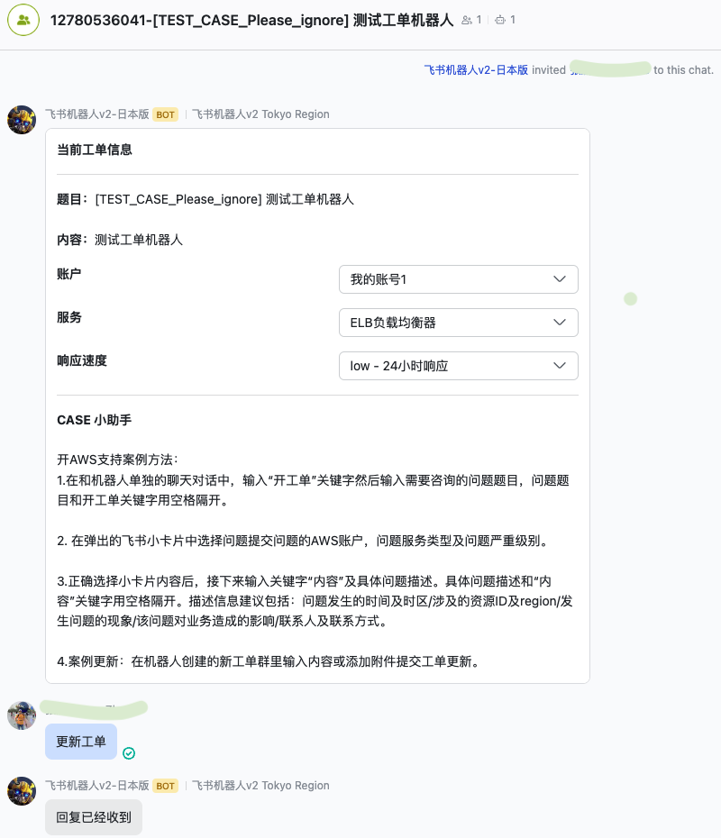

# 飞书AWS工单机器人 - 企业飞书即时通信工具AWS工单系统接入方案 
---
飞书AWS工单机器人是一套基于飞书企业通信工具的方便用户和AWS售后工程师快捷文字沟通的工具。飞书用户可以通过简单的机器人关键字和飞书小卡片互动，向售后工程师团队提交支持案例，更新案例内容，以及准实时接收来自后台工程师的更新。

## 目录
---
[架构图](#架构图)

[操作手册](#操作手册)

[开工单操作](#开工单操作)

[工单群交互操作](#工单群交互操作)

[切换AWS支持系统的电话或者聊天室功能](#切换AWS支持系统的电话或者聊天室功能)

[工单历史查询操作](#工单历史查询操作)

[部署和配置](#部署和配置)

[CDK部署机器人服务端](#CDK部署机器人服务端)

[创建自定义机器人应用](#创建自定义机器人应用)

[创建工单API角色](#创建工单API角色)

[在DynamoDB中配置机器人的自定义参数](#在DynamoDB中配置机器人的自定义参数)

[设置AppID和AppSecret参数](#设置AppID和AppSecret参数)

[设置机器人可以选择的工单账号权限](#设置机器人可以选择的工单账号权限)

[设置机器人用户白名单](#设置机器人用户白名单)

[设置机器人支持的AWS服务](#设置机器人支持的AWS服务)

[设置机器人支持的工单严重级别](#设置机器人支持的工单严重级别)

[设置卡片提示信息，机器人回复信息等(可选配置)](#设置卡片提示信息，机器人回复信息等(可选配置))

[开启周期性轮询工单推送功能](#开启周期性轮询工单推送功能)

[成本预估](#成本预估)

[待开发功能](#TODO列表)

[开发步骤](#开发步骤)


## 架构图


## 操作手册
---

飞书AWS工单机器人应用主要通过关键字和小卡片的方式交互。

支持的关键字有： 

* “开工单” “问题” 关键字，用于创建工单时定义工单的Title内容
* “内容”关键字， 用于创建工单时定义工单的初始Content内容
* “历史”关键字， 用于向机器人查询工单历史记录
* “帮助”关键字， 用于打印当前工单创建状态卡片及帮助信息

小卡片用于选择AWS账号，AWS服务及严重级别


#### 开工单操作
1. 找到飞书AWS工单机器人应用，在和机器人单聊群中，输入“开工单”关键字 + 空格 + 工单题目触发开工单流程。


工单题目正确输入后，会显示在接下来弹出的小卡片中的题目段落中。

2. 输入工单账号，服务内容及严重级别


在小卡片中正确选择对应的账号，服务及严重级别。

**选择过程中有概率会出现飞书提示error的情况，这个报错是由于飞书服务器端调用机器人服务后端API时，没有在3秒时间返回导致。这种情况通常是由于网络延迟导致，可以耐心多次尝试直到下拉框内容不再提示报错。**


小卡片中的账号，服务及严重级别都可以通过自定义的方式显示。具体配置方式请参考下面的说明：

[设置机器人可以选择的工单账号权限](#设置机器人可以选择的工单账号权限)

[设置机器人用户白名单](#设置机器人用户白名单)

[设置机器人支持的AWS服务](#设置机器人支持的AWS服务)

[设置机器人支持的工单严重级别](#设置机器人支持的工单严重级别)

[设置卡片提示信息，机器人回复信息等(可选配置)](#设置卡片提示信息，机器人回复信息等(可选配置))

3. 输入“内容”关键字 + 空格 + 工单内容 触发机器人开工单及开工单群功能。


“内容”关键字用于写入创建工单后的初始comment。 


[回到目录](#目录)

#### 工单群交互操作
当机器人收集到以下5部分全部信息后，即会开始掉用support API完成开工单动作。工单创建完毕后，机器人会用新创建CASE的Display ID + 工单题目作为飞书群的名称创建一个飞书群，并且把创建工单的飞书用户加入到这个群中。

###### 用户更新群信息



在工单群中输入任何文字信息，机器人会捕获相关事件，并且以工单Comment的形式更新到AWS后端。

###### 上传附件操作

当需要提交附件给后台支持工程师的时候，只需要把附件拖入到工单群即可。

###### AWS后台工程师更新同步

机器人人会通过轮询的方式获取工单的远端更新信息，并且同步到工单群中。

轮询周期设置方式请参考[开启周期性轮询工单推送功能](#开启周期性轮询工单推送功能)。

#### 切换AWS支持系统的电话或者聊天室功能

每个工单群中，在群顶部会有个以CASELINK命名的飞书群TAB，点击该链接即可进入该CASE的AWS支持服务界面。可以通过AWS支持服务界面选择使用其他的支持服务功能。

例如电话支持，聊天支持及工单打分。

#### 工单历史查询操作

和机器人交互时，使用历史关键字+空格+数字n可以显示过去n天的工单信息。


[回到目录](#目录)

## 部署和配置
---
机器人通过SDK实现自动化部署及更新。部署和配置过程主要包含四个步骤，分别是：

1. CDK 部署机器人后端资源
2. 在飞书开放平台创建自定义机器人应用，设置消息卡片请求地址及事件订阅请求地址
3. 在DynamoDB中配置机器人的自定义参数
4. 创建SupportAPI角色

下面分别介绍每个步骤的详细操作方式。


[回到目录](#目录)

#### CDK部署机器人服务端
---

飞书机器人服务端可以选择在一个AWS账号中部署，通过assume role的方式调用其他账号（包括本账号）的role进行support API操作。部署账号本身没有特殊要求。由于飞书服务器端在国内，并且发送请求时对回调地址（机器人服务器端）的请求有响应时间的要求，因此应该尽量选择距离国内较近的region。实测发现飞书服务器端到AWS日本和新加坡Region的延迟相对较低，建议在这两个region中选择一个部署。


0. 安装CDK工具

使用下面命令安装cdk工具。

```
npm install -g aws-cdk
```
参考下面官方文档安装cdk工具
https://docs.aws.amazon.com/cdk/v2/guide/getting_started.html


1. 从官方仓库下载源代码及lambda二进制文件（适用于没有go开发环境的部署环境）

```
git clone https://github.com/zhang1980s/larkbot.git
```


2. 初始化CDK部署环境（如果当前Region之前没有初始化过CDK环境）

```
$ cdk bootstrap aws://<accountID>/<region> --profile <profile>
```

用当前部署的账号ID和地区以及当前环境中的AWS profile （如有必要）替代上面的示例命令中的对应项目。

例如，下面命令在123456789012账号的ap-northeast-1地区，使用global profile初始化cdk环境。

```
$ cdk bootstrap aws://123456789012/ap-northeast-1 --profile global

  cdk bootstrap aws://123456789012/ap-northeast-1 --profile global
 ⏳  Bootstrapping environment aws://123456789012/ap-northeast-1...
Trusted accounts for deployment: (none)
Trusted accounts for lookup: (none)
Using default execution policy of 'arn:aws:iam::aws:policy/AdministratorAccess'. Pass '--cloudformation-execution-policies' to customize.
CDKToolkit: creating CloudFormation changeset...
 ✅  Environment aws://123456789012/ap-northeast-1 bootstrapped.
```

该命令会通过cloudformation创建用于cdk部署的相应iam policy，role以及用于存储状态数据的s3存储桶。

参考文档：

什么是CDK
https://docs.aws.amazon.com/cdk/v2/guide/home.html

Bootstrapping CDK
https://docs.aws.amazon.com/cdk/v2/guide/bootstrapping.html


3. 通过CDK部署飞书机器人后端环境

进入larkbot仓库的主目录，执行cdk-deploy-to.sh 脚本在指定账号的指定Region中部署飞书机器人后端环境。cdk命令会通过cloudformation的方式创建相关资源及对应的最小权限关系。


```
$ cd larkbot
$ npm i --save-dev @types/node
$ ./cdk-deploy-to.sh <accountID> <region> --context stackName=<stackname> --profile <profile>
```

上面命令通过输入 --context stackName 参数自定义stackName，如果未输入此参数，飞书机器人会使用默认的"LarkbotAppStack"作为cloudformation的stack名称。

例如，下面命令在123456789012账号的ap-northeast-1地区，使用global profile创建飞书机器人后端。

 ```
 ./cdk-deploy-to.sh 123456789012 ap-northeast-1 --profile global --context stackName=larkbot

✨  Synthesis time: 7.73s

larkbot:  start: Building 8823c5122e6d34f5b8f013ff748df0c0e2f8d78e7d6fcb8e5dd9863f5f31cc95:123456789012-ap-northeast-1
larkbot:  success: Built 8823c5122e6d34f5b8f013ff748df0c0e2f8d78e7d6fcb8e5dd9863f5f31cc95:123456789012-ap-northeast-1
larkbot:  start: Building 63a30f564d7b72bdec248adf1074770947b5356568f272138db30aa8d7c781cc:123456789012-ap-northeast-1
larkbot:  success: Built 63a30f564d7b72bdec248adf1074770947b5356568f272138db30aa8d7c781cc:123456789012-ap-northeast-1
larkbot:  start: Publishing 8823c5122e6d34f5b8f013ff748df0c0e2f8d78e7d6fcb8e5dd9863f5f31cc95:123456789012-ap-northeast-1
larkbot:  start: Publishing 63a30f564d7b72bdec248adf1074770947b5356568f272138db30aa8d7c781cc:123456789012-ap-northeast-1
larkbot:  success: Published 63a30f564d7b72bdec248adf1074770947b5356568f272138db30aa8d7c781cc:123456789012-ap-northeast-1
larkbot:  success: Published 8823c5122e6d34f5b8f013ff748df0c0e2f8d78e7d6fcb8e5dd9863f5f31cc95:123456789012-ap-northeast-1
This deployment will make potentially sensitive changes according to your current security approval level (--require-approval broadening).
Please confirm you intend to make the following modifications:

...
(NOTE: There may be security-related changes not in this list. See https://github.com/aws/aws-cdk/issues/1299)

Do you wish to deploy these changes (y/n)? y
LarkbotAppStack (larkbot): deploying... [1/1]
larkbot: creating CloudFormation changeset...


...

 ✅  LarkbotAppStack (larkbot)

✨  Deployment time: 133.44s

Outputs:
LarkbotAppStack.msgEventRoleArn = arn:aws:iam::123456789012:role/larkbot-larkbotmsgeventServiceRoleC3080B6B-V1ESZLK7ODYY
LarkbotAppStack.msgEventapiEndpointAC31EC6D = https://t68l424zt0.execute-api.ap-northeast-1.amazonaws.com/prod/
Stack ARN:
arn:aws:cloudformation:ap-northeast-1:123456789012:stack/larkbot/b35ccb10-6c3a-11ee-bef1-02e3082fe481

✨  Total time: 141.17s

 ```

参考文档：
https://docs.aws.amazon.com/cdk/v2/guide/environments.html


在cdk部署完成后，程序会输出下面两个参数，保存这两个参数的输出，后面配置飞书自定义机器人应用及设置支持support API的role时会用到。

```
Outputs:
LarkbotAppStack.msgEventRoleArn = arn:aws:iam::123456789012:role/larkbot-larkbotmsgeventServiceRoleC3080B6B-V1ESZLK7ODYY
LarkbotAppStack.msgEventapiEndpointAC31EC6D = https://t68l424zt0.execute-api.ap-northeast-1.amazonaws.com/prod/
```

4. 删除飞书机器人后端（如果必要）

登陆飞书机器人部署的AWS账号，选择部署地区，进入cloudformation服务界面，可以看到对应的CloudFormation stack，删除此stack。如果之前已经使用了飞书机器人，还需要清理机器人产生的Cloudwatch log group以避免额外的费用。


[回到目录](#目录)

#### 创建自定义机器人应用
---

1. 访问飞书开放平台https://open.feishu.cn, 确认已经使用飞书账号登陆飞书开放平台

2. 在页面的右上角点击开发者后台，然后在开发者后台主页中，点击创建企业自建应用按钮


3. 在创建企业自建应用页面中输入应用的名称，应用描述，应用图标及背景色，选择完毕后点击创建


4. 在添加应用能力页面中，点击机器人选项框左下角中的添加按钮


5. 在机器人配置的主页中，点击机器人配置标题右侧的粉笔按钮编辑机器人配置


6. 在消息卡片请求网址的选项框中，输入CDK程序部署完成后输出的msgEventapiEndpoint的URL，并且添加"/messages"路径


例如：
```
Outputs:
LarkbotAppStack.msgEventRoleArn = arn:aws:iam::123456789012:role/larkbot-larkbotmsgeventServiceRoleC3080B6B-V1ESZLK7ODYY
LarkbotAppStack.msgEventapiEndpointAC31EC6D = https://t68l424zt0.execute-api.ap-northeast-1.amazonaws.com/prod/

```

添加/messages路径：

```
https://t68l424zt0.execute-api.ap-northeast-1.amazonaws.com/prod/messages
```


点击验证没有任何输出表示飞书机器人后端响应正常。如果提示“请求URL验证未通过”，需要检查URL格式是否正常，或者选择距离国内更近的AWS Region部署机器人应用。

（飞书会向该URL发送一个challenge值并且要求1s回复challenge的值，如果无法及时返回则提示请求URL验证未通过）


7. 点击页面左侧中开发配置段落中的事件订阅功能，在事件订阅功能中配置请求地址，输入和消息卡片请求网址相同的URL


例如：
```
Outputs:
LarkbotAppStack.msgEventRoleArn = arn:aws:iam::123456789012:role/larkbot-larkbotmsgeventServiceRoleC3080B6B-V1ESZLK7ODYY
LarkbotAppStack.msgEventapiEndpointAC31EC6D = https://t68l424zt0.execute-api.ap-northeast-1.amazonaws.com/prod/

```

添加/messages路径：

```
https://t68l424zt0.execute-api.ap-northeast-1.amazonaws.com/prod/messages
```

8. 权限管理

飞书管理员需要授权飞书机器人执行一些必要的单聊或群聊消息接收，发送，读取基本通讯录信息及附件处理功能的权限。在机器人配置的主页中，点击页面最左侧的开发配置段落中的权限管理功能。

**消息与群组权限**

在屏幕中央的权限配置的页面中，选择消息与群组，点击选择下面截屏中全部的权限。


进入权限列表的第二页,点击选择下面四个权限。


**通讯录权限**

选择权限配置中的通讯录权限，添加下列两个权限。


**批量开通**

全部选择完毕后，点击页面右上角的批量开通按钮。在批量开通提示菜单中，可以选择确定回到机器人配置主页继续调整权限，或者点击确认并前往创建应用版本发布机器人。


**版本发布**

权限选择完毕后，需要发布机器人。进入机器人配置主页左侧的应用发布段落的版本管理与发布功能，点击右上角的创建新版本


输入相应的版本信息，然后点击发布。在机器人的可用范围选项中，选择添加所有可能用到机器人的飞书账号信息。但是如果飞书机器人被加入到群聊中，群聊中的用户即使没有被加入到机器人的可用范围列表中，仍然可以通过群聊添加机器人并且和机器人对话。

要限制机器人的使用，需要使用白名单功能。


9.  事件订阅

在飞书机器人配置主页，在页面左侧开发配置段落中，选择事件订阅功能，然后选择添加事件按钮。


在列表中选择消息与群组中的接受消息(v2.0),然后点击确认添加。


正确添加订阅消息权限后，页面应展示下面的内容。


10. 设置AppID和AppSecret

App ID 飞书平台标记应用的唯一标识。App Secret是用于获取应用app_access_token的密钥。飞书工单机器人后端会把这两个重要信息保存在Secret Manager中。

**获取AppID和AppSecret**

在飞书机器人配置主页，在页面左侧的基础信息段落中，找到凭证与基础信息配置。获取应用凭证中的App ID和 App Secret内容。


**在Secret Manager中更新Secret内容**

把这两个内容分别填入cdk在secret manager服务中创建两个Secret中：


点击进入对应的Secret Manager的资源，找到Secret Value，点击Edit，把对应的机器人AppID和AppSecret信息输入对应的Secret值。


[回到目录](#目录)

#### 创建工单API角色

在需要飞书AWS工单机器人进行工单交互的账号中，创建相应的IAM Role，用于机器人通过Support API进行交互。

登陆相关账号：

在[Identity and Access Management (IAM)](https://us-east-1.console.aws.amazon.com/iamv2/home#/roles)页面中，选择创建个新role。

选择Custom trust policy


在Custom trust policy中的Principal中，加入CDK部署输出中msgEventRoleArn的值。

示例CDK输出：

```
Outputs:
LarkbotAppStack.msgEventRoleArn = arn:aws:iam::123456789012:role/larkbot-larkbotmsgeventServiceRoleC3080B6B-V1ESZLK7ODYY
```


示例policy样式：

```
{
    "Version": "2012-10-17",
    "Statement": [
        {
            "Effect": "Allow",
            "Principal": {
                "AWS": "arn:aws:iam::123456789012:role/larkbot-larkbotmsgeventServiceRoleC3080B6B-V1ESZLK7ODYY"
            },
            "Action": "sts:AssumeRole"
        }
    ]
}
```

点击下一步进入权限选择页面，选择"AWSSupportAllFullAccess"


点击下一步输入角色名 "arn:aws:iam::<AccountID>:role/FeishuSupportCaseApiAll<自定义后缀>"。

CDK默认设置lambda支持assume到任何账号中角色名称以FeishuSupportCaseApiAll字符串开头的角色。

```
    // Attach the policy document that allow to assume the support role in others accounts to the lambda function's role
        msgEventAlias.addToRolePolicy(new iam.PolicyStatement(
          {
            sid: 'AllowToAssumeToRoleWithSupportAPIAccess',
            effect: iam.Effect.ALLOW,
            actions: ['sts:AssumeRole'],
            resources: ['arn:aws:iam::*:role/FeishuSupportCaseApiAll*']
          }
        ))
```


如需使用其他自定义的角色名，需要在lambda的larkbotmsgeventServiceRoleDefaultPolicy中允许lambda assume到自定义role。

例如：

```
        {
            "Action": "sts:AssumeRole",
            "Resource": [
              "arn:aws:iam::<accountID>:role/<custom role name>",
              "arn:aws:iam::<accountID>:role/<custom role name>"
            ]
            "Effect": "Allow",
            "Sid": "AllowToAssumeToRoleWithSupportAPIAccess"
        },

```

记录所有新创建role的ARN。


[回到目录](#目录)

#### 在DynamoDB中配置机器人的自定义参数
---

机器人的配置可以通过CDK创建的DynamoDB中以<stackname>-botconfig<cloudformation后缀>命名的表中配置。

每个机器人使用一个配置文件，通过lambda环境变量中的CFG_KEY指定，默认值是LarkBotProfile-0。每个CFG_KEY对应DyanmoDB中的一条记录。记录的Primary Key的值就是CFG_KEY对应的值。

在ddb-example目录中提供了一个参考配置，可以直接把内容复制到botconfig表中，基于参考配置做修改。

下面是主要需要修改的配置内容

###### 设置AppID和AppSecret参数

```
    "app_id_arn": "arn:aws:secretsmanager:<region>:<accountID>:secret:AppIDSecretXXX",
    "app_secret_arn": "arn:aws:secretsmanager:<region>:<accountID>:secret:AppSecretSecretXXX",
```

把上面参数修改为CDK创建的Secret Manager资源的对应的ARN


###### 设置机器人可以选择的工单账号权限

根据下列格式，配置指定账号可以使用的role arn。
```
    "accounts": {
     "0": {
      "role_arn": "arn:aws:iam::<accountID>:role/FeishuSupportCaseApiAll"
     },
     "1": {
      "role_arn": "arn:aws:iam::<AccountID>:role/FeishuSupportCaseApiAll"
     }
    },
```

在elements属性中，选择小卡片中显示的账号名。其中value的数值对应上面的Accounts的数值。content内容可以自定义。
```
      "elements": [
  
       {
        "extra": {
         "options": [
          {
           "text": {
            "content": "我的账号1",
            "tag": "plain_text"
           },
           "value": "0"
          },
          {
           "text": {
            "content": "我的账号2",
            "tag": "plain_text"
           },
           "value": "1"
          }
         ],
```

###### 设置机器人用户白名单

添加允许使用机器人的飞书userID到白名单。

```
    "user_whitelist": {
     "b123456": "张同学",
     "c654321": "李同学"
    }
```

获取用户ID方式：https://open.feishu.cn/document/home/user-identity-introduction/how-to-get


###### 设置机器人支持的AWS服务


下面示例显示机器人支持选择的服务列表：

每个服务有两部分内容需要填写，第一个内容是service code，第二个内容是service category code。每个service code下通常都会有general-guidance类型的service categories。为了减少小卡片的交互，增加机器人支持的某些服务时，找到general-guidance类型的service category code填写到对应的服务项目中。 

使用aws support describe-services命令获取完整的service code和service categories信息。

```
    "service_map": {
     "0": [
      "general-info",
      "using-aws"
     ],
     "1": [
      "amazon-elastic-compute-cloud-linux",
      "other"
     ],
     "2": [
      "amazon-simple-storage-service",
      "general-guidance"
     ],
     "3": [
      "amazon-virtual-private-cloud",
      "general-guidance"
     ],
```

下面示例显示了小卡片菜单中显示的名称和上面配置中定义的项目数字的对应关系。content内容可以自定义。

```
          {
           "text": {
            "content": "general-info",
            "tag": "plain_text"
           },
           "value": "0"
          },
          {
           "text": {
            "content": "amazon-elastic-compute-cloud-linux",
            "tag": "plain_text"
           },
           "value": "1"
          },
          {
           "text": {
            "content": "amazon-simple-storage-service",
            "tag": "plain_text"
           },
           "value": "2"
          },
```

###### 设置机器人支持的工单严重级别


下面示例设置了机器人支持的工单服务级别。

```
    "sev_map": {
     "critical": "critical",
     "high": "high",
     "low": "low",
     "normal": "normal",
     "urgent": "urgent"
    },
```


下面示例设置了小卡片可选择的服务级别及菜单提示信息。content内容可以自定义。

```
          {
           "text": {
            "content": "low - 24小时响应",
            "tag": "plain_text"
           },
           "value": "low"
          },
          {
           "text": {
            "content": "normal - 12小时响应",
            "tag": "plain_text"
           },
           "value": "normal"
          },
          {
           "text": {
            "content": "high - 4小时响应",
            "tag": "plain_text"
           },
           "value": "high"
          },
          {
           "text": {
            "content": "urgent - 1小时响应",
            "tag": "plain_text"
           },
           "value": "urgent"
          },
          {
           "text": {
            "content": "critical - 15分钟响应",
            "tag": "plain_text"
           },
           "value": "critical"
          }
```

###### 设置卡片提示信息，机器人回复信息等(可选配置)

* 工单群中收到回复和附件后机器人的回复信息

```
    "ack": "回复已经收到",
```

* 工单小卡片的帮助信息

```
       {
        "content": "\n --------------\n**CASE 小助手**\n\n开AWS支持案例方法：\n1.在和机器人单独的聊天对话中，输入“开工单”关键字然后输入需要咨询的问题题目，问题题目和开工单关键字用空格隔开。\t\n\n2. 在弹出的飞书小卡片中选择问题提交问题的AWS账户，问题服务类型及问题严重级别。\t\n\n3.正确选择小卡片内容后，接下来输入关键字“内容”及具体问题描述。具体问题描述和“内容”关键字用空格隔开。描述信息建议包括：问题发生的时间及时区/涉及的资源ID及region/发生问题的现象/该问题对业务造成的影响/联系人及联系方式。\t\n\n4.案例更新：在机器人创建的新工单群里输入内容或添加附件提交工单更新。",
        "tag": "markdown"
       }
```

* 非白名单用户使用机器人时提示信息

```
"no_permission_msg": "你没有权限开工单，请联系XXX获取帮助"
```


[回到目录](#目录)

#### 开启周期性轮询工单推送功能

访问Amazon EventBridge服务主页，在页面左侧，在Buses段落中找到找到Rules编辑页面。找到机器人对应的Rule，开启该Rule。

轮询周期在Eventbridge rule相同位置调整。也可以通过cdk部署命令进行调整。默认轮询周期为10分钟，可以使用下面命令调整为其他的数值，例如：

```
./cdk-deploy-to.sh <accountID> <region> --context stackName=<stackname> --parameters RefreshInterval=20 --profile <profile>
```

上面命令把轮询周期设置为20分钟一次。

（TODO：通过CDK更新开启/关闭Rule功能）

#### AWS中国区工单系统支持

机器人默认使用AWS海外区工单系统。如果需要接入AWS中国区工单系统，需要调整lambda的环境变量 SUPPORT_REGION的值为cn。


例如：

```
SUPPORT_REGION=cn
```


如果这个值被设置为非‘cn’，则机器人默认使用海外Support API endpoint。


#### AWS工单语言支持

AWS Support API支持提交工单时选择语言。当前支持的语言是：

中文， 对应zh语言码；
日文， 对应ja语言码；
韩文， 对应ko语言码；
英文， 对应en语言码；

```
"zh", "ja", "ko", "en"
```

机器人默认使用zh。如需获取其他语言支持工单，可以调整lambda环境变量中的CASE_LANGUAGE参数。 例如下面示例指定机器人使用英文支持队列。

```
CASE_LANGUAGE=en
```

[回到目录](#目录)

## 成本预估
---

1. lambda / dynamodb 表的成本都可以在freetier覆盖。
2. 需要注意cloudwatch log 的迭代，后期会加入功能自动过期历史日志


[回到目录](#目录)

## TODO列表
---
[TODO List](TODO.md)


[回到目录](#目录)


## 开发步骤
---
机器人主要由两部分代码组成：CDK部署代码和lambda代码。

#### 修改lambda代码
lambda代码修改完毕后，进入lambda/msg-event目录，执行make命令。脚本会自动生成新的lambda 二进制文件。

然后执行cdk-deploy-to.sh 脚本，使用上一次部署相同的参数，cdk会自动识别lambda二进制文件发生改变并自动更新到AWS环境中。

#### 修改cdk代码
cdk代码修改完毕后，直接执行cdk-deploy-to.sh脚本，使用上一次部署相同的参数，cdk会自动识别基础设施配置变更并自动更新到AWS环境中。